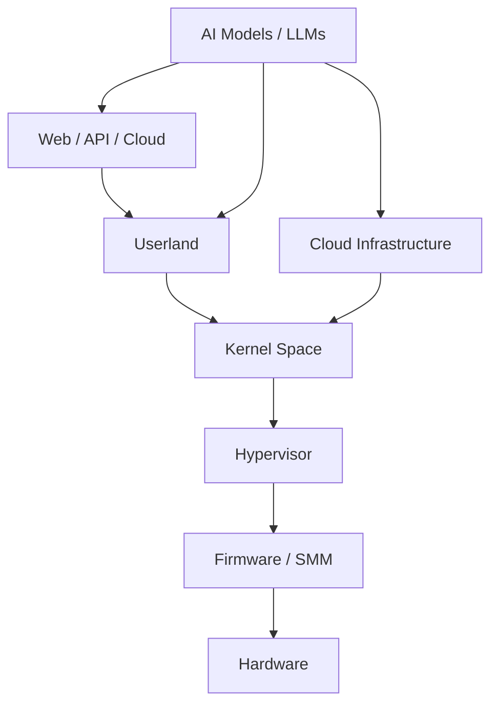
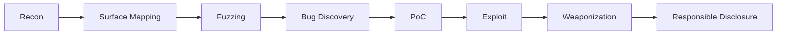
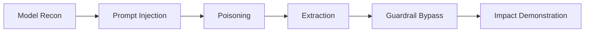
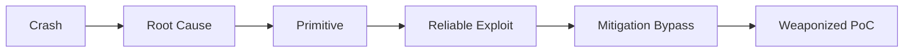

<div align="center">


<a href="https://git.io/typing-svg">

</a>

<br/>


</div>

---

## 🧾 OPERATOR DOSSIER

```
Handle     : VoidChecksum
Role       : Offensive Security Engineer
Specialty  : AI Red Teaming | Exploit Development | Bug Bounty
Philosophy : Exploit → Understand → Automate → Harden
```

---

## 🎯 ATTACK SURFACE MAP



---

## 🧬 CORE OPERATIONAL DOMAINS

| Domain | Coverage |
|------|--------|
| Bug Bounty Hunting | Web, API, Cloud, Logic Flaws |
| AI Penetration Testing | Prompt Injection, RAG Poisoning, Model Extraction |
| Reverse Engineering | Malware, Drivers, Firmware |
| Exploit Development | Stack, Heap, Kernel, Shellcode |
| Evasion Engineering | AMSI, ETW, EDR |

---

## ⚔️ OFFENSIVE KILL CHAIN



---

## 🤖 AI RED TEAM ATTACK CHAIN



---

## 🧠 EXPLOIT DEVELOPMENT FLOW



---

## 🛠 TOOLCHAIN

**Pentesting**  
Burp • ffuf • Nuclei • sqlmap • Metasploit  

**Reverse Engineering**  
Ghidra • IDA • x64dbg • WinDBG  

**AI / ML**  
PyTorch • HuggingFace • Custom Harnesses  

**Languages**  
C • C++ • Python • ASM • Bash • PowerShell  

---

## 🧪 PRIVILEGE TARGETING

```
Web → API → Userland → Kernel → Hypervisor → Firmware
```

---

## 🌐 LIVE TRAINING PLATFORM

<div align="center">

<a href="https://tryhackme.com/p/v0idch3cksum">

</a>

</div>

---

## 🧠 OPERATING DOCTRINE

```
Low Noise
High Signal
Relentless Curiosity
```

---

## 🤝 CONTACT

Discord: @v0idch3cksum  
GitHub: https://github.com/VoidChecksum  

---


